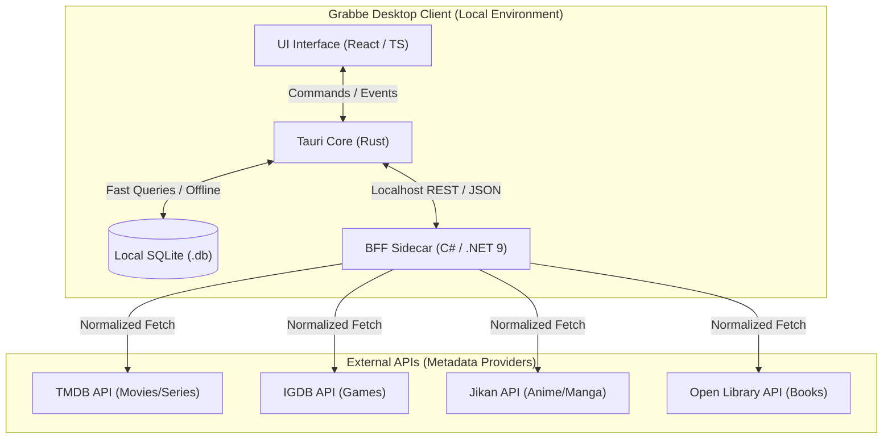

# **Architecture Context & PRD — Grabbe**

**Version:** 1.0.0 (Desktop-First / Local-First / Enterprise Ready)

**Status:** Stable / Release

**Target Audience:** Engineering, Product, and Design

## **1. Executive Vision**

**Grabbe** is a desktop tracking and ranking application designed to be the ultimate ecosystem for organizing entertainment media (Games, Anime, Manga, Books, Comics, Movies, and Series).

Built under the **Local-First** paradigm, Grabbe ensures the user has full ownership of their data, operating self-sufficiently and offline by default. The application delivers a high-performance experience, eliminating load times and reliance on constant connectivity, using the cloud only as a metadata search tool and, in the future, for optional synchronization.

## **2. Product Scope and Principles**

* **Desktop-First:** Initial focus on desktop operating systems (Windows, macOS, Linux) to ensure a rich interface, shortcut navigation, and maximum performance.
* **Local-First & Offline by Design:** The primary database resides on the user's machine. Reading, writing, ranking, and statistics features do not depend on the internet.
* **Media Platform Agnostic:** A universal tracker. The user doesn't need 5 different applications to log what they consume.
* **Functional Minimalism:** A clutter-free interface, focusing on media art (covers) and efficient data entry.

## **3. Detailed Technical Architecture**

The architecture consists of a local-first desktop client running Tauri, which integrates a C# (.NET 9.0) background process acting as a **local BFF sidecar** (gateway and normalizer). 

* **Local-First & Sidecar Execution:** In production, the BFF is compiled as a self-contained sidecar executable and packaged with the application (configured in `tauri.conf.prod.json`). Tauri spawns and manages the lifetime of this local BFF process. Communication between Tauri and the BFF occurs over `localhost:18493`.
* **Zero Cloud Dependency for Core Logic:** The primary SQLite database resides entirely on the user's machine, allowing the app to read, write, rank, and track media offline. The BFF is used purely as an anti-corruption layer to query external metadata APIs when online.

### **3.1. Tech Stack**

* **Frontend (Desktop):** Tauri (Core in Rust, User Interface in React/TypeScript).
* **Local Database:** SQLite, integrated via Tauri SQL Plugin (`@tauri-apps/plugin-sql`).
* **BFF (Backend for Frontend):** C# (.NET 9.0), running locally as a sidecar process.
* **BFF Cache / Sync:** Planned future phases (e.g. MemoryCache/Redis for BFF caching; event sourcing for cloud sync).

### **3.2. Architecture Diagram**



## **4. BFF (Backend for Frontend) Aggregator Design**

The BFF acts as a shield between Grabbe Desktop and third-party APIs. The desktop client **never** makes direct requests to TMDB or Jikan.

### **4.1. Overview and Responsibilities**

Grabbe's Backend for Frontend (BFF) acts as an intermediary (Aggregator and Normalizer). It has three main responsibilities:

1. **Contract Unification / Anti-Corruption Layer (ACL):** Whether the source is TMDB, Jikan, OpenLibrary, or IGDB, the BFF receives distinct JSON payloads from each provider and transforms them into a single universal standard (`GrabbeMediaDTO`). Each external client acts as an ACL boundary, ensuring the Tauri frontend never depends on external API-specific structures. The DTO is source-agnostic, abstracts concepts into universal terms, and normalizes details like community scores.
2. **Rate Limit Protection and Management:** APIs like IGDB and Jikan have strict limits. The BFF manages client instantiation and throttling (e.g. via Polly retries) to handle rate-limiting.
3. **Structured Caching (Planned):** A structured `Infrastructure/Cache/` module exists to cache provider responses locally for repeated searches, reducing duplicate API queries. (This is planned for future optimization and is empty/inactive in the initial v1.0.0 release).

### **4.2. Project Structure and Environment Setup**

The project follows a structure based on separation of concerns by features (Vertical Slice Architecture). The repository structure is organized as follows:

```plaintext
grabbe-bff/  
├── .gitignore               # Ignores local configurations (.env.local, bin/, obj/, etc.)  
├── .env.local               # Local file for API credentials (MUST NOT be committed)  
├── Grabbe.BFF.sln           # C# Solution file  
└── src/  
    └── Grabbe.API/  
        ├── Grabbe.API.csproj  # Project file  
        ├── Program.cs         # Application entry and dependency injection setup  
        ├── appsettings.json  
        ├── Domain/  
        │   └── DTOs/  
        │       └── GrabbeMediaDTO.cs  
        ├── Features/  
        │   ├── Credentials/   # Key validation endpoints  
        │   ├── MediaDetails/  
        │   │   ├── DetailsController.cs  
        │   │   └── DetailsService.cs  
        │   └── MediaSearch/  
        │       ├── SearchController.cs  
        │       └── SearchAggregationService.cs  
        └── Infrastructure/  
            ├── Cache/         # Caching mechanisms (placeholder for future phases)  
            ├── Configuration/  
            │   └── AppSettingsService.cs  # Resolves credentials from local SQLite DB or .NET configs  
            └── ExternalClients/  
                ├── IMediaProviderClient.cs  
                ├── TMDB/  
                ├── Jikan/  
                ├── OpenLibrary/
                └── IGDB/
```

**Development Setup:**

* The solution can be natively opened in Rider or Visual Studio, ensuring the `.sln` and `.csproj` files are properly tracked by Git.
* Sensitive keys (like TMDB API keys and IGDB Twitch Client credentials) must be isolated in the `.env.local` file at the project root for local development, or configured as Environment Variables.

### **4.3. Concurrency and Performance Patterns**

For global searches (when the user doesn't filter the media type and searches all sources simultaneously), the BFF must optimize response times by executing concurrent asynchronous calls.

The `SearchAggregationService` will use `Task.WhenAll` to fire requests to TMDB, Jikan, OpenLibrary, and IGDB at the same time, await all of them, flatten the lists, and return the unified array to the frontend.

### **4.4. External Clients Specifications (Inputs)**

Each external client maps only the necessary fields from its API into the universal `GrabbeMediaDTO`. The detail endpoint uses `append_to_response` (TMDB) or equivalent strategies to fetch rich metadata in a single round-trip.

## A. TMDB Client (Movies and Series)**

* **Base Endpoint:** `https://api.themoviedb.org/3`
* **Authentication:** Header `Authorization: Bearer {TMDB_READ_ACCESS_TOKEN}` (Read from `.env.local`).
* **Detail Query:** `?append_to_response=credits,alternative_titles`
* **Mapping:**
  * `poster_path` -> `CoverImageUrl` (concatenated with `https://image.tmdb.org/t/p/w500/`)
  * `overview` -> `Description`
  * `vote_average` -> `CommunityScore` (rounded to 1 decimal, scale 0-10)
  * `production_companies[0].name` -> `PublisherOrStudio`
  * `runtime` -> `FormattedConsumptionMetric` ("Xh Ym" for movies) / `episode_run_time` ("X min per ep" for series)
  * `number_of_episodes` -> `TotalProgressUnits` (series only; null for movies)
  * `credits.crew` (Director) + `credits.cast` (top 5) -> `KeyPeople`
  * `alternative_titles` -> `AlternativeTitles`

## B. Jikan Client (Anime and Manga)**

* **Base Endpoint:** `https://api.jikan.moe/v4`
* **Authentication:** None (Open API).
* **Critical Restriction:** Limit of 3 requests per second. The `JikanClient` should implement a retry policy (e.g., Polly library with exponential backoff) to handle the 429 Too Many Requests status.
* **Mapping:**
  * `images.jpg.image_url` -> `CoverImageUrl`
  * `synopsis` -> `Description`
  * `score` -> `CommunityScore` (already 0-10 scale)
  * `studios[0].name` (Anime) / `serializations[0].name` (Manga) -> `PublisherOrStudio`
  * `duration` -> `FormattedConsumptionMetric` (used as-is, e.g. "24 min per ep")
  * `episodes` (Anime) / `chapters` (Manga) -> `TotalProgressUnits`
  * `titles` (non-Default) -> `AlternativeTitles`
  * `KeyPeople`: left empty (would require extra `/characters` call).

## C. Open Library Client (Books)**

* **Base Endpoint:** `https://openlibrary.org`
* **Authentication:** None (Free & Public API, no key required).
* **Mapping:**
  * `cover_i` -> `CoverImageUrl` (mapped using `https://covers.openlibrary.org/b/id/{cover_i}-L.jpg`)
  * `description` -> `Description` (supports string or text/markdown object)
  * `ratings_average` -> `CommunityScore` (multiplied by 2 to normalize from 1-5 to 0-10 scale)
  * `publisher` -> `PublisherOrStudio`
  * `number_of_pages_median` -> `FormattedConsumptionMetric` ("X pages") and `TotalProgressUnits`
  * `author_name` -> `KeyPeople` (with Role = "Author")

## D. IGDB Client (Games)**

* **Base Endpoint:** `https://api.igdb.com/v4`
* **Authentication:** Twitch OAuth client credentials token. Requires headers `Client-ID: {IGDB_CLIENT_ID}` and `Authorization: Bearer {Access_Token}`.
* **Mapping:**
  * `id` -> `ExternalId`
  * `name` -> `Title`
  * `summary` -> `Description`
  * `cover.url` -> `CoverImageUrl` (mapped using `https:` prefix and converting `t_thumb` size to `t_cover_big`)
  * `rating` -> `CommunityScore` (divided by 10 to normalize from 0-100 to 0-10 scale)
  * `involved_companies` -> `PublisherOrStudio` (extracts name of developer or publisher company)
  * `first_release_date` -> `ReleaseDate` (unix timestamp converted to year string)
  * `genres.name` -> `Genres`
  * `alternative_names.name` -> `AlternativeTitles`

## **5. Actual Database Schema Structure (Local SQLite)**

The relational model below ensures the integrity of the user's history and supports the ranking system and consumption logs in the Desktop client.

```sql
-- TABLE: AppSettings (Stores user preferences and API credentials locally)
CREATE TABLE AppSettings (
    key TEXT PRIMARY KEY,
    value TEXT NOT NULL
);

-- TABLE: Media (Stores local metadata cache of media for offline functioning)
CREATE TABLE Media (
    id TEXT PRIMARY KEY, -- Locally generated UUID
    external_id TEXT NOT NULL, -- Original API ID (e.g. TMDB id)
    source_api TEXT NOT NULL, -- 'TMDB', 'JIKAN', 'OPENLIBRARY', 'IGDB'
    type TEXT NOT NULL, -- 'MOVIE', 'SERIES', 'ANIME', 'MANGA', 'BOOK', 'GAME'
    title TEXT NOT NULL,
    description TEXT,
    cover_image_path TEXT, -- Local path or URL
    release_date DATE,
    franchise TEXT,
    genres TEXT, -- JSON array of strings
    consumption_metric TEXT, -- Page count or duration unit format
    release_year TEXT,
    community_score REAL,
    publisher_or_studio TEXT,
    original_language TEXT,
    alternative_titles TEXT, -- JSON string list
    key_people TEXT, -- JSON list of people and roles
    total_progress_units INTEGER, -- Total episodes, pages, etc.
    created_at DATETIME DEFAULT CURRENT_TIMESTAMP
);

-- TABLE: UserTracking (The user's tracking state regarding a specific media)
CREATE TABLE UserTracking (
    id TEXT PRIMARY KEY, -- Locally generated UUID
    media_id TEXT NOT NULL,
    status TEXT NOT NULL, -- 'PLANNED', 'CONSUMING', 'ON HOLD', 'DROPPED', 'COMPLETED'
    progress INTEGER DEFAULT 0, -- Current unit (e.g. episode or pages read)
    total_progress INTEGER, -- Copy of Media's total_progress_units
    rewatch_count INTEGER DEFAULT 0,
    review_text TEXT, -- Optional review notes
    updated_at DATETIME DEFAULT CURRENT_TIMESTAMP,
    FOREIGN KEY (media_id) REFERENCES Media(id)
);

-- TABLE: ConsumptionSession (Records consumption intervals/rewatches)
CREATE TABLE ConsumptionSession (
    id TEXT PRIMARY KEY,
    tracking_id TEXT NOT NULL,
    session_number INTEGER DEFAULT 1, -- 1 = First run, 2 = First replay, etc.
    start_date DATETIME,
    finish_date DATETIME,
    is_active BOOLEAN DEFAULT TRUE,
    created_at DATETIME DEFAULT CURRENT_TIMESTAMP,
    FOREIGN KEY (tracking_id) REFERENCES UserTracking(id)
);

-- TABLE: TrackingHistory (Immutable event timeline of status/progress updates)
CREATE TABLE TrackingHistory (
    id TEXT PRIMARY KEY,
    tracking_id TEXT NOT NULL,
    event_type TEXT NOT NULL, -- e.g. 'STATUS_CHANGE', 'PROGRESS_UPDATE'
    previous_value TEXT,
    new_value TEXT,
    event_date DATETIME DEFAULT CURRENT_TIMESTAMP,
    FOREIGN KEY (tracking_id) REFERENCES UserTracking(id)
);

-- TABLE: Ranking (Stores user evaluation score out of 10)
CREATE TABLE Ranking (
    id TEXT PRIMARY KEY,
    media_id TEXT NOT NULL UNIQUE, -- UNIQUE ensures 1-to-1 rating per Media
    score INTEGER CHECK (score >= 1 AND score <= 10),
    review_text TEXT,
    created_at DATETIME DEFAULT CURRENT_TIMESTAMP,
    updated_at DATETIME DEFAULT CURRENT_TIMESTAMP,
    FOREIGN KEY (media_id) REFERENCES Media(id)
);

-- INDEX: Ensures uniqueness of external provider entries in cached Media
CREATE UNIQUE INDEX idx_media_external_source ON Media(external_id, source_api);
```

## **6. Detailed Features (Core)**

### **6.1. Tracking Engine**

* **Progression Logic:** The app must adapt the numerical control. Example: For *Books*, track Pages or Percentage. For *Series*, Season/Episode. For *Games*, Hours played or Achievements (manual).
* **Automatic Transitions:** If the user updates the episode from 1 to 2, the status automatically changes from "Planned"/"Dropped" to "Consuming". If it reaches the total episodes, it changes to "Completed" and fills `finish_date`.

### **6.2. Personal Ranking System**

The user will have a global view of their reviews.

* **Automatic Tier List:** Based on 1 to 10 scores, the app can generate List viewings separating Movies, Games, and Anime on the same panel.

### **6.3. Consumption Dates Management (Timeline Control)**

* **Intelligent Auto-fill:** The system will automatically log the `start_date` on the day the status changes to "Consuming" and the `finish_date` on the day it changes to "Completed".
* **Manual Control (Overwrite):** The user will have complete freedom to edit these dates via a Date Picker.
* **Supported Use Cases:**
  * **Retroactive Logging:** Entering media consumed in the past.
  * **Forgetfulness Correction:** Adjusting the completion date to past days.
  * **Import Preparation:** Structure ready to receive imported data (MyAnimeList, Letterboxd, etc).

### **6.4. Replay / Rewatch / Reread System**

* **Session History:** Each "Replay" will create a new "Consumption Session" tied to that media, with its own `start_date` and `finish_date`.
* **Data Preservation:** Previous replays will be saved in the media's "History".
* **Review Overwrite:** The score and text review are unique per media. When re-evaluating, previous data is overwritten, reflecting the user's most current view.

## **7. Communication Contracts and Endpoints (BFF ↔ Desktop)**

### **7.1. Unified Object Pattern (GrabbeMediaDTO) — Anti-Corruption Layer**

The BFF acts as an **Anti-Corruption Layer (ACL)**: each external client translates provider-specific responses into this universal, source-agnostic contract. The frontend never sees TMDB, Jikan, or GBooks data structures — only `GrabbeMediaDTO`.

**A. C# Class (BFF Output):**

```csharp
namespace Grabbe.API.Domain.DTOs;

public class GrabbeMediaDTO
{
    public required string ExternalId { get; set; }
    public required string SourceApi { get; set; }  // "TMDB", "JIKAN", "OPENLIBRARY"
    public required string Type { get; set; }       // "MOVIE", "SERIES", "ANIME", "MANGA", "BOOK", "GAME"
    public required string Title { get; set; }
    public string? Description { get; set; }
    public string? CoverImageUrl { get; set; }
    public string? ReleaseDate { get; set; }        // Year only, e.g. "2024"
    public List<string> Genres { get; set; } = new();
    public string? OriginalLanguage { get; set; }

    // --- Universal abstracted fields ---
    public double? CommunityScore { get; set; }               // 0-10 scale
    public string? PublisherOrStudio { get; set; }             // Studio, Publisher, or Production Company
    public string? FormattedConsumptionMetric { get; set; }    // "2h 49m", "24 min per ep", "450 pages"
    public int? TotalProgressUnits { get; set; }               // Total episodes or pages. Null for movies.

    public List<string> AlternativeTitles { get; set; } = new();
    public List<MediaPersonDTO> KeyPeople { get; set; } = new();
}

public class MediaPersonDTO
{
    public required string Name { get; set; }
    public required string Role { get; set; }
    public string? ImageUrl { get; set; }
}
```

**B. JSON Response (Consumed by Frontend):**

```json
{
  "externalId": "11004",
  "sourceApi": "JIKAN",
  "type": "ANIME",
  "title": "Hunter x Hunter (2011)",
  "description": "Gon Freecss dreams of becoming a Hunter...",
  "coverImageUrl": "https://cdn.myanimelist.net/...",
  "releaseDate": "2011",
  "genres": ["Action", "Adventure", "Fantasy"],
  "originalLanguage": null,
  "communityScore": 9.1,
  "publisherOrStudio": "Madhouse",
  "formattedConsumptionMetric": "23 min per ep",
  "totalProgressUnits": 148,
  "alternativeTitles": ["ハンター×ハンター (2011)", "HxH (2011)"],
  "keyPeople": []
}
```

### **7.2. BFF Endpoints**

**1. Global Search (Concurrent)**
Responsible for searching media from the search bar. If no type is specified, it triggers all APIs via `Task.WhenAll` and merges the results.

* **Route:** `GET /api/v1/search?query={text}&type={MOVIE|ANIME|BOOK}&page=1`
* **Response Example:**

```json
{
  "data": [
    {
      "externalId": "tt0903747",
      "sourceApi": "TMDB",
      "type": "SERIES",
      "title": "Breaking Bad",
      "description": "A high school chemistry teacher...",
      "coverImageUrl": "https://image.tmdb.org/t/p/w500/...",
      "releaseDate": "2008",
      "genres": ["Drama", "Crime"],
      "communityScore": 8.9,
      "totalProgressUnits": 62
    }
  ],
  "meta": {
    "currentPage": 1,
    "totalPages": 3,
    "totalResults": 45
  }
}
```

> **Note:** Pagination metadata (`meta.currentPage`, `meta.totalPages`) is not yet implemented. Results are returned as a flat array under `data`.

**2. Deep Media Details**
Fetches deep metadata of the work, bypassing batch search cache limits.

* **Route:** `GET /api/v1/media/{sourceApi}/{type}/{externalId}`
* **Example:** `/api/v1/media/JIKAN/ANIME/11004`
* **Response Example:**

```json
{
  "data": {
    "externalId": "11004",
    "sourceApi": "JIKAN",
    "type": "ANIME",
    "title": "Hunter x Hunter (2011)",
    "description": "Gon Freecss dreams of becoming a Hunter...",
    "coverImageUrl": "https://cdn.myanimelist.net/...",
    "releaseDate": "2011",
    "genres": ["Action", "Adventure"],
    "communityScore": 9.1,
    "publisherOrStudio": "Madhouse",
    "formattedConsumptionMetric": "23 min per ep",
    "totalProgressUnits": 148,
    "alternativeTitles": ["ハンター×ハンター (2011)"],
    "keyPeople": []
  }
}
```

**3. Trending (Hot Items)**
Feeds the "Discover" tab.

* **Route:** `GET /api/v1/trending?type={mediaType}`
* **Status:** ⚠️ Not yet implemented — endpoint does not exist in the current BFF codebase.

### **7.3. Standardized Error Handling**

If there is an external API failure or the rate limit is exceeded, the frontend will receive this format:

```json
{
  "error": {
    "code": "EXTERNAL_API_RATE_LIMIT",
    "message": "The source API (JIKAN) is currently limiting requests. Please try again.",
    "sourceApi": "JIKAN"
  }
}
```

## **8. Retention, Identity, and Shareability Engine**

### **8.1. Grabbe Recap (Entertainment "Wrapped")**

* **Frequency:** Monthly and Yearly.
* **Export:** "Story" (9:16) or landscape format, generating a `.png` in one click.
* **Local Insights:** Time Invested, "Your Monthly Trinity", Binge Habits.

### **8.2. Unified Profile Card**

* **Hall of Fame:** Pin 4 to 5 favorite works at the top.
* **Statistics:** Completed media, consumption radar chart, hours of life invested.
* **Export:** Horizontal banner for social networks.

### **8.3. Deep Analytics Dashboard**

* **Niche Connections:** Taste patterns by studio/genre.
* **Dispersion and Bias:** Correlation between Given Score and Release Year.

---

## **9. Code Documentation Guidelines**

This section defines the standards for documenting all code — both the C# BFF and the TypeScript/React frontend. These rules must be respected when writing or reviewing code in this project.

### **9.1. General Principles**

| Principle | Rule |
| --- | --- |
| **Clarity over Verbosity** | A comment should explain *why*, not *what*. If a variable or method name is self-explanatory, do not add a comment. |
| **Name First** | If a comment is needed because a name is confusing, rename the thing instead of adding the comment. |
| **English Only** | All comments, documentation strings, and error messages must be in English. |
| **Preserve Volatile Notes** | `TODO:`, `FIXME:`, and `HACK:` tags must be kept exactly as written. They represent intentional technical debt. |

---

### **9.2. Backend (C# / .NET) Standards**

#### Standard: XML Documentation (`///`)

All `public` classes, interfaces, and methods **must** have an XML documentation block. These comments feed directly into the Swagger/OpenAPI spec via `<GenerateDocumentationFile>true</GenerateDocumentationFile>` in the `.csproj`.

```csharp
/// <summary>
/// Resolves media detail requests to the correct external provider using a Strategy pattern.
/// At runtime, it selects the matching <see cref="IMediaProviderClient"/> implementation
/// from the DI-injected collection based on the caller-supplied <c>sourceApi</c> name.
/// </summary>
public class DetailsService { ... }
```

**Required tags:**

* `<summary>` — on every public class, interface, and method. Explain intent and business context.
* `<param name="x">` — on every method parameter.
* `<returns>` — on every non-void method.
* `<see cref="T">` — to cross-reference related types.
* `<inheritdoc/>` — on interface implementations that repeat the contract without adding detail.

#### Rule: Do Not Document the Obvious

```csharp
// ❌ Noise — do not write
// Loops through all clients
foreach (var client in _clients) { ... }

// ✅ Document the non-obvious — the architectural pattern
// Uses a Scatter-Gather pattern: all provider calls are parallel via Task.WhenAll.
```

#### Rule: Complex LINQ must explain the 'Why'

```csharp
// ❌ No comment needed — it reads itself
.Where(g => g.Name != null)

// ✅ The 'why' is non-obvious — requires a comment
// Exclude Japanese-language animation (genre 16) from TMDB results.
// These are anime titles that would be duplicated by the dedicated Jikan client.
.Where(media => !(media.OriginalLanguage == "ja" && media.GenreIds.Contains(16)))
```

#### Rule: Document Mathematical Normalizations

When a value from an external API is transformed to fit the internal contract, always explain the conversion:

```csharp
// Google Books uses a 0–5 star rating scale. Multiplying by 2 normalizes it to the
// universal 0–10 scale used across all providers in GrabbeMediaDTO.
CommunityScore = Math.Round(info.AverageRating.Value * 2, 1)
```

---

### **9.3. Frontend (TypeScript / React) Standards**

#### Standard: TSDoc (`/** */`)

All exported **components**, **hooks**, and **utility functions** must have a TSDoc block. These blocks improve IDE tooltips and are the primary documentation mechanism for the frontend design system.

```typescript
/**
 * A highly versatile card component for displaying media items across the application.
 * Adapts its internal layout and hover effects based on the `variant` prop.
 */
export const MediaCard = ({ variant = 'library', ... }: MediaCardProps) => { ... };
```

**Required for:**

* All exported React components
* All `interface` and `type` definitions in `types.ts` or shared files
* All utility functions (e.g., `getDb`, `upsertMedia`)
* All database access functions in `lib/db.ts`

#### Standard: `@param` and `@returns` for Utility Functions

```typescript
/**
 * Saves or updates tracking progress for a media item.
 * Follows a local-first pipeline:
 * 1. Upserts the core media definition.
 * 2. Synchronizes tracking progress, session dates, and user ranking.
 *
 * @param mediaId The internal UUID of the media
 * @param status The current tracking status (e.g., CONSUMING, COMPLETED)
 * @returns The tracking ID
 */
export async function saveTracking(...) { ... }
```

#### Rule: No Comments for Standard React Patterns

```typescript
// ❌ Remove — this is obvious
// useEffect hook
useEffect(() => { ... }, []);

// ❌ Remove — structural dividers add noise
// ─── Left Column ───────────────────────────────

// ✅ Only explain non-obvious logic
// Exclude `effectiveTotal = 1` from the divisor to prevent a divide-by-zero crash
// when total progress is unknown.
const effectiveTotal = total && total > 0 ? total : 1;
```

#### Rule: Document Status Transition Logic

Status transitions in the tracking engine are business-critical. When a handler auto-transitions state (e.g., incrementing progress to trigger COMPLETED), that logic must be explained:

```typescript
/**
 * Increments progress.
 * Automatically transitions status to CONSUMING if starting,
 * or COMPLETED if reaching the total unit count.
 */
const handleQuickProgress = async () => { ... };
```

---

### **9.4. What Not to Document**

The following patterns should **never** have a comment:

| Pattern | Reason |
| --- | --- |
| `if (result == null) return null;` | Self-explanatory null guard |
| JSX structural dividers (`{/* Left Column */}`) | The component tree is the structure |
| Framework lifecycle methods with no custom logic | `useEffect`, `useState` calls that are idiomatic |
| `return Ok(new { Data = results })` | Envelope shape is documented at the controller level |
| Standard DI registration lines in `Program.cs` | Idiomatic .NET boilerplate |

## **10. Product Roadmap and Deliverables**

### **Phase 1: MVP - Focus on Local Retention**

* [x] Desktop Architecture Setup (Tauri) + SQLite.
* [x] BFF Implementation for initial providers.
* [x] CRUD operations on local tracking.
* [x] Main Interface.
* [x] Basic Ranking System (1 to 10).

### **Phase 2: Identity, Engagement, and Statistics**

* [x] Search history.
* [x] Analytics Dashboard.
* [x] Consumption Timeline.
* [ ] Commands Palette
* [ ] Unified Profile Card with exportable Banner.
* [x] Grabbe Recap (Story Export).
* [x] Manual data Export/Import.
* [ ] Themes choices.
* [x] Add new providers.

### **Phase 3: Cloud and Ecosystem**

* [ ] Sync Engine (Event Sourcing).
* [ ] Mobile apps (iOS/Android).
* [ ] Public Profiles on the Web (e.g., grabbe.app/u/user).
