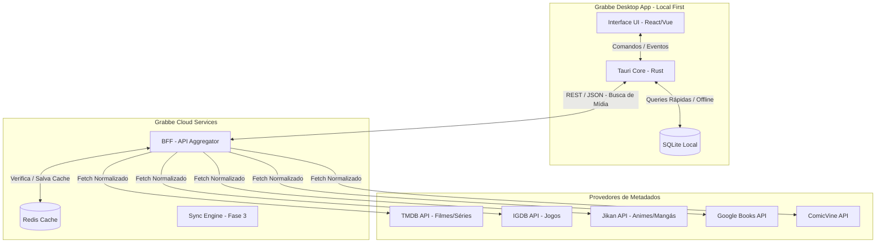

# **Architecture Context & PRD — Grabbe**

**Versão:** 1.3 (Desktop-First / Local-First / Enterprise Ready)

**Status:** Em Planejamento

**Público-Alvo da Documentação:** Engenharia, Produto e Design

## **1. Visão Executiva**

O **Grabbe** é uma aplicação desktop de tracking e ranking projetada para ser o ecossistema definitivo de organização de mídias de entretenimento (Jogos, Animes, Mangás, Livros, Quadrinhos, Filmes e Séries).

Construído sob o paradigma **Local-First**, o Grabbe garante que o usuário tenha posse total de seus dados, operando de forma autossuficiente e offline por padrão. O aplicativo entrega uma experiência de altíssimo desempenho, eliminando tempos de carregamento e dependência de conectividade constante, utilizando a nuvem apenas como ferramenta de busca de metadados e, no futuro, para sincronização opcional.

## **2. Escopo e Princípios do Produto**

* **Desktop-First:** Foco inicial em sistemas operacionais desktop (Windows, macOS, Linux) para garantir uma interface rica, navegação em atalhos e máxima performance.
* **Local-First & Offline por Design:** O banco de dados primário reside na máquina do usuário. Funcionalidades de leitura, escrita, ranking e estatísticas não dependem de internet.
* **Agnóstico de Plataforma de Mídia:** Um tracker universal. O usuário não precisa de 5 aplicativos diferentes para registrar o que consome.
* **Minimalismo Funcional:** Interface sem poluição visual, focada na arte da mídia (capas) e na eficiência do registro de dados.

## **3. Arquitetura Técnica Detalhada**

A arquitetura é dividida em dois domínios principais: a **Aplicação Cliente (Desktop)** e o **Serviço de Apoio (BFF na Nuvem)**.

### **3.1. Stack Tecnológico Recomendado**

* **Frontend (Desktop):** Tauri (Core em Rust, Interface em React/TypeScript ou Vue). O Tauri oferece um binário muito menor e consumo de RAM drasticamente inferior ao Electron, essencial para um app que roda em background.
* **Banco de Dados Local:** SQLite via Prisma ORM ou Drizzle (integrado ao frontend) ou via abstração no core em Rust.
* **BFF (Backend for Frontend):** C# (.NET 8 ou superior) devido à sua excelente performance na manipulação de concorrência e chamadas assíncronas múltiplas para APIs externas.
* **Cache do BFF:** Redis ou IMemoryCache (para armazenar respostas das APIs externas e evitar rate-limiting).

### **3.2. Diagrama de Arquitetura**



## **4. Design do BFF (Backend for Frontend) Agregador**

O BFF atua como um escudo entre o Grabbe Desktop e as APIs de terceiros. O cliente desktop **nunca** faz requisições diretas ao TMDB ou Jikan.

### **4.1. Visão Geral e Responsabilidades**

O Backend for Frontend (BFF) do Grabbe atua como um intermediário (Agregador e Normalizador). Ele tem três responsabilidades principais:

1. **Unificação de Contratos / Normalização:** Independentemente de a origem ser o Jikan, TMDB ou GBooks, o BFF recebe JSONs distintos de APIs diferentes e os transforma em um único padrão (`GrabbeMediaDTO`). O frontend não precisa saber lidar com estruturas JSON diferentes.
2. **Proteção e Gerenciamento de Rate Limit:** APIs como IGDB e Jikan têm limites estritos. O BFF enfileira ou limita chamadas para não estourar os limites gratuitos.
3. **Caching Agressivo (Redis/Memória):** Armazena respostas para buscas repetidas, reduzindo a latência para milissegundos. Ex: Se o usuário busca "Breaking Bad", o BFF consulta o TMDB, formata e salva com um TTL de 7 a 15 dias. A próxima busca baterá apenas no cache.

### **4.2. Estrutura do Projeto e Configuração do Ambiente**

O projeto segue uma estrutura baseada em separação de responsabilidades por features (Vertical Slice Architecture). Para garantir o funcionamento correto e evitar problemas de versionamento de código na IDE, a estrutura do repositório deve ser montada da seguinte forma:

```plaintext
grabbe-bff/  
├── .gitignore               # Deve ignorar .env.local, .idea/ (se aplicável), bin/, obj/  
├── .env.local               # Arquivo local para chaves de API (NÃO deve ser enviado ao repositório)  
├── Grabbe.BFF.sln           # Arquivo da solução (Deve ser enviado ao repositório)  
└── src/  
    └── Grabbe.API/  
        ├── Grabbe.API.csproj  # Arquivo do projeto (Deve ser enviado ao repositório)  
        ├── Program.cs  
        ├── appsettings.json  
        ├── Domain/  
        │   └── DTOs/  
        │       └── GrabbeMediaDTO.cs  
        ├── Features/  
        │   ├── MediaDetails/  
        │   │   ├── DetailsController.cs  
        │   │   └── DetailsService.cs  
        │   └── MediaSearch/  
        │       ├── SearchController.cs  
        │       └── SearchAggregationService.cs  
        └── Infrastructure/  
            ├── Cache/  
            ├── Configuration/  
            │   └── ExternalApiOptions.cs  
            └── ExternalClients/  
                ├── IMediaProviderClient.cs  
                ├── TMDB/  
                ├── Jikan/  
                └── GBooks/
```

**Setup de Desenvolvimento:**
* A solução pode ser aberta nativamente no Rider ou Visual Studio, garantindo que os arquivos `.sln` e `.csproj` estejam devidamente rastreados pelo Git.
* As chaves sensíveis (como a API Key do TMDB e Google) devem ficar isoladas no arquivo `.env.local` na raiz do projeto.

### **4.3. Padrões de Concorrência e Performance**

Para buscas globais (quando o usuário não filtra o tipo de mídia e busca em todas as fontes simultaneamente), o BFF deve otimizar o tempo de resposta realizando chamadas assíncronas concorrentes.

O `MediaAggregationService` utilizará `Task.WhenAll` para disparar as requisições para o TMDB, Jikan e GBooks ao mesmo tempo, aguardar a resolução de todas, achatar as listas, ordenar por relevância e retornar o array unificado ao frontend.

### **4.4. Especificações dos Clients Externos (Inputs)**

O C# mapeará apenas os campos necessários de cada API externa para evitar sobrecarga de memória.

**A. TMDB Client (Filmes e Séries)**
* **Endpoint Base:** `https://api.themoviedb.org/3`
* **Autenticação:** Header `Authorization: Bearer {TMDB_READ_ACCESS_TOKEN}` (Lido do `.env.local`).
* **Mapeamento:**
  * `poster_path` -> `CoverImageUrl` (necessita concatenar com `https://image.tmdb.org/t/p/w500/`)
  * `overview` -> `Description`
  * Se for série (TV), mapear `number_of_episodes` para `TotalProgress`.

**B. Jikan Client (Animes e Mangás)**
* **Endpoint Base:** `https://api.jikan.moe/v4`
* **Autenticação:** Nenhuma (API Aberta).
* **Restrição Crítica:** Limite de 3 requisições por segundo. O `JikanClient` deve implementar política de retentativas (ex: Polly library com backoff exponencial) para lidar com o status 429 Too Many Requests.
* **Mapeamento:**
  * `images.jpg.image_url` -> `CoverImageUrl`
  * `synopsis` -> `Description`
  * `episodes` (Anime) ou `chapters` (Mangá) -> `TotalProgress`

**C. Google Books Client (Livros)**
* **Endpoint Base:** `https://www.googleapis.com/books/v1`
* **Autenticação:** Query param `?key={GBOOKS_API_KEY}` (Lido do `.env.local`).
* **Mapeamento (extraído de volumeInfo):**
  * `imageLinks.thumbnail` -> `CoverImageUrl`
  * `description` -> `Description`
  * `pageCount` -> `TotalProgress`
  * `authors` -> Mapeado como meta-informação, se necessário.

## **5. Estrutura Ideal do Database Schema (SQLite Local)**

O modelo relacional abaixo garante a integridade do histórico do usuário e suporta o sistema de rankings e logs de consumo no cliente Desktop.

```sql
-- TABELA: Media (Armazena o cache local das mídias para funcionamento offline)
CREATE TABLE Media (
    id TEXT PRIMARY KEY, -- UUID gerado localmente
    external_id TEXT NOT NULL, -- ID da API original (ex: TMDB id)
    source_api TEXT NOT NULL, -- 'TMDB', 'JIKAN', 'IGDB', etc.
    type TEXT NOT NULL, -- 'MOVIE', 'GAME', 'ANIME', etc.
    title TEXT NOT NULL,
    description TEXT,
    cover_image_path TEXT, -- Caminho local salvo no media_cache ou URL
    release_date DATE,
    franchise TEXT,
    genres TEXT, -- JSON ou string separada por vírgulas
    created_at DATETIME DEFAULT CURRENT_TIMESTAMP
);

-- TABELA: UserTracking (O estado atual e global do usuário em relação à mídia)
CREATE TABLE UserTracking (
    id TEXT PRIMARY KEY,
    media_id TEXT NOT NULL,
    status TEXT NOT NULL, -- 'PLANNED', 'CONSUMING', 'PAUSED', 'DROPPED', 'COMPLETED'
    progress INTEGER DEFAULT 0, -- Episódio atual, horas jogadas, ou % de leitura
    total_progress INTEGER, -- Total de episódios/capítulos (copiado da Media)
    rewatch_count INTEGER DEFAULT 0, -- Incrementado automaticamente a cada nova sessão concluída
    notes TEXT, -- Mantido da versão anterior para anotações gerais
    updated_at DATETIME DEFAULT CURRENT_TIMESTAMP,
    FOREIGN KEY (media_id) REFERENCES Media(id)
);

-- TABELA: ConsumptionSession (Registra cada vez que a mídia é consumida/rejogada)
CREATE TABLE ConsumptionSession (
    id TEXT PRIMARY KEY,
    tracking_id TEXT NOT NULL,
    session_number INTEGER DEFAULT 1, -- 1 = Primeira vez, 2 = Primeiro Replay, etc.
    start_date DATETIME,
    finish_date DATETIME,
    is_active BOOLEAN DEFAULT TRUE, -- Identifica se é a sessão que está rodando no momento
    created_at DATETIME DEFAULT CURRENT_TIMESTAMP,
    FOREIGN KEY (tracking_id) REFERENCES UserTracking(id)
);

-- TABELA: TrackingHistory (Registro imutável para a "Timeline de consumo")
CREATE TABLE TrackingHistory (
    id TEXT PRIMARY KEY,
    tracking_id TEXT NOT NULL,
    event_type TEXT NOT NULL, -- 'STATUS_CHANGE', 'PROGRESS_UPDATE', 'SESSION_START'
    previous_value TEXT,
    new_value TEXT,
    event_date DATETIME DEFAULT CURRENT_TIMESTAMP,
    FOREIGN KEY (tracking_id) REFERENCES UserTracking(id)
);

-- TABELA: Ranking (Avaliações do usuário - 1:1 com a Media)
CREATE TABLE Ranking (
    id TEXT PRIMARY KEY,
    media_id TEXT NOT NULL UNIQUE, -- O UNIQUE garante que a nota seja sempre sobrescrita
    score INTEGER CHECK (score >= 1 AND score <= 10),
    review_text TEXT,
    created_at DATETIME DEFAULT CURRENT_TIMESTAMP, -- Mantido da versão anterior
    updated_at DATETIME DEFAULT CURRENT_TIMESTAMP,
    FOREIGN KEY (media_id) REFERENCES Media(id)
);
```

## **6. Funcionalidades Detalhadas (Core)**

### **6.1. Motor de Tracking**

* **Lógica de Progressão:** O app deve adaptar o controle numérico. Exemplo: Para *Livros*, rastreia Páginas ou Porcentagem. Para *Séries*, Temporada/Episódio. Para *Jogos*, Horas jogadas ou Conquistas (manual).
* **Transições Automáticas:** Se o usuário atualiza o episódio de 1 para 2, o status muda automaticamente de "Planejado" para "Consumindo". Se atinge o total de episódios, muda para "Concluído" e preenche a `finish_date`.

### **6.2. Sistema de Ranking Pessoal**

O usuário terá uma visão global de suas avaliações.
* **Tier List Automática:** Com base nas notas de 1 a 10, o app pode gerar visualizações em formato Lista separando Filmes, Jogos e Animes no mesmo painel.

### **6.3. Gestão de Datas de Consumo (Timeline Control)**

* **Preenchimento Automático Inteligente:** O sistema registrará automaticamente a `start_date` no dia em que o status mudar para "Consumindo" e a `finish_date` no dia em que mudar para "Concluído".
* **Controle Manual (Sobrescrita):** O usuário terá total liberdade para editar essas datas através de um Date Picker.
* **Casos de Uso Suportados:**
  * **Catalogação Retroativa:** Inserir mídias consumidas no passado.
  * **Correção de Esquecimento:** Ajustar a data de conclusão para dias passados.
  * **Preparação para Importação:** Estrutura pronta para receber dados importados (MyAnimeList, Letterboxd, etc).

### **6.4. Sistema de Replay / Rewatch / Reread**

* **Histórico de Sessões:** Cada "Replay" criará uma nova "Sessão de Consumo" atrelada àquela mídia, com suas próprias `start_date` e `finish_date`.
* **Preservação de Dados:** Os replays anteriores ficarão salvos no "Histórico" da mídia.
* **Sobrescrita de Avaliação:** A nota e a review em texto são singulares por mídia. Ao reavaliar, os dados anteriores são sobrescritos, refletindo a visão mais atual do usuário.

## **7. Contratos de Comunicação e Endpoints (BFF ↔ Desktop)**

### **7.1. Padrão de Objeto Unificado (GrabbeMediaDTO)**

Este é o schema que o aplicativo em React/Tauri vai consumir. O C# garante que ele sempre saia neste formato, independentemente da fonte original.

**A. Classe C# (Saída do BFF):**
```csharp
namespace Grabbe.API.Domain.DTOs;

public class GrabbeMediaDTO  
{  
    public required string ExternalId { get; set; }  
    public required string SourceApi { get; set; } // "TMDB", "JIKAN", "GBOOKS"  
    public required string Type { get; set; }      // "MOVIE", "SERIES", "ANIME", "MANGA", "BOOK"  
    public required string Title { get; set; }  
    public string? Description { get; set; }  
    public string? CoverImageUrl { get; set; }  
    public string? ReleaseDate { get; set; }       // ISO 8601 (YYYY-MM-DD)  
    public List<string> Genres { get; set; } = new();  
    public int? TotalProgress { get; set; }        // Episódios totais ou páginas do livro  
}

public class PaginatedResponse<T>  
{  
    public required IEnumerable<T> Data { get; set; }  
    public int CurrentPage { get; set; }  
    public int TotalPages { get; set; }  
    public int TotalResults { get; set; }  
}
```

**B. JSON de Resposta (Consumido pelo Frontend):**
```json
{
  "externalId": "string",
  "sourceApi": "string",
  "type": "string",
  "title": "string",
  "description": "string",
  "coverImageUrl": "string",
  "releaseDate": "string",
  "franchise": "string",
  "genres": ["string"],
  "totalProgress": 0
}
```

### **7.2. Endpoints do BFF**

**1. Busca Global (Concorrente)**
Responsável por buscar mídias a partir da barra de pesquisa. Se nenhum tipo for especificado, aciona todas as APIs via `Task.WhenAll` e mescla os resultados.
* **Rota:** `GET /api/v1/search?query={texto}&type={MOVIE|ANIME|BOOK}&page=1`
* **Exemplo de Resposta:**
```json
{
  "data": [
    {
      "externalId": "tt0903747",
      "sourceApi": "TMDB",
      "type": "SERIES",
      "title": "Breaking Bad",
      "description": "Um professor de química...",
      "coverImageUrl": "https://image.tmdb.org/t/p/w500/...",
      "releaseDate": "2008-01-20",
      "genres": ["Drama", "Crime"],
      "totalProgress": 62
    }
  ],
  "meta": {
    "currentPage": 1,
    "totalPages": 3,
    "totalResults": 45
  }
}
```

**2. Detalhes Profundos da Mídia**
Busca os metadados profundos da obra contornando limites de cache de busca em lote.
* **Rota:** `GET /api/v1/media/{sourceApi}/{type}/{externalId}`
* **Exemplo:** `/api/v1/media/JIKAN/ANIME/11004`
* **Exemplo de Resposta:**
```json
{
  "data": {
    "externalId": "11004",
    "sourceApi": "JIKAN",
    "type": "ANIME",
    "title": "Hunter x Hunter (2011)",
    "description": "Gon Freecss sonha em se tornar um Hunter...",
    "coverImageUrl": "https://cdn.myanimelist.net/...",
    "releaseDate": "2011-10-02",
    "genres": ["Action", "Adventure"],
    "totalProgress": 148,
    "extraMetadata": {
      "studios": ["Madhouse"],
      "status": "Finished Airing"
    }
  }
}
```

**3. Trending (Itens em Alta)**
Alimenta a aba "Descobrir".
* **Rota:** `GET /api/v1/trending?type={mediaType}`

### **7.3. Tratamento de Erros Padronizado**

Se houver falha na API externa ou o rate limit for estourado, o front-end receberá este formato:

```json
{
  "error": {
    "code": "EXTERNAL_API_RATE_LIMIT",
    "message": "A API de origem (JIKAN) está limitando as requisições no momento. Tente novamente.",
    "sourceApi": "JIKAN"
  }
}
```

## **8. Motor de Retenção, Identidade e Shareability**

### **8.1. Grabbe Recap (O "Wrapped" do Entretenimento)**
* **Frequência:** Mensal e Anual.
* **Exportação:** Formato "Story" (9:16) ou paisagem, gerando um `.png` em um clique.
* **Insights Locais:** Tempo Investido, "Sua Trindade do Mês", Hábitos de Maratona.

### **8.2. Cartão de Perfil Unificado**
* **Hall da Fama:** Fixar 4 a 5 obras favoritas no topo.
* **Estatísticas:** Mídias concluídas, gráfico de radar de consumo, horas de vida investidas.
* **Exportação:** Banner horizontal para redes sociais.

### **8.3. Dashboard Analítico Profundo**
* **Conexões de Nicho:** Padrões de gosto por estúdio/gênero.
* **Dispersão e Viés:** Correlação entre Nota Atribuída e Ano de Lançamento.

## **9. Roadmap de Produto e Entregas**

### **Fase 1: MVP - Foco em Retenção Local**
* [ ] Setup da arquitetura Desktop (Tauri) + SQLite.
* [x] Implementação do BFF para provedores iniciais.
* [ ] Operações CRUD no rastreamento local.
* [ ] Interface Principal.
* [ ] Sistema de Ranking Básico (1 a 10).

### **Fase 2: Identidade, Engajamento e Estatísticas**
* [ ] Cartão de Perfil Unificado com Banner exportável.
* [ ] Grabbe Recap (Story Export).
* [ ] Dashboard Analítico.
* [ ] Timeline de Consumo.
* [ ] Exportação/Importação de dados manuais.

### **Fase 3: Cloud e Ecossistema**
* [ ] Sync Engine (Event Sourcing).
* [ ] Apps mobile (iOS/Android).
* [ ] Perfis Públicos na Web (ex: grabbe.app/u/usuario).
