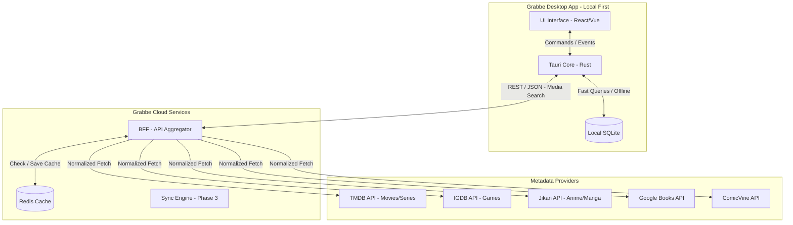

# **Architecture Context & PRD — Grabbe**

*(Para a versão em Português, role para baixo / For Portuguese version, scroll down)*

**Version:** 1.3 (Desktop-First / Local-First / Enterprise Ready)

**Status:** In Planning

**Target Audience:** Engineering, Product, and Design

## **1. Executive Vision**

**Grabbe** is a desktop tracking and ranking application designed to be the ultimate ecosystem for organizing entertainment media (Games, Anime, Manga, Books, Comics, Movies, and Series).

Built under the **Local-First** paradigm, Grabbe ensures the user has full ownership of their data, operating self-sufficiently and offline by default. The application delivers a high-performance experience, eliminating load times and reliance on constant connectivity, using the cloud only as a metadata search tool and, in the future, for optional synchronization.

## **2. Product Scope and Principles**

* **Desktop-First:** Initial focus on desktop operating systems (Windows, macOS, Linux) to ensure a rich interface, shortcut navigation, and maximum performance.
* **Local-First & Offline by Design:** The primary database resides on the user's machine. Reading, writing, ranking, and statistics features do not depend on the internet.
* **Media Platform Agnostic:** A universal tracker. The user doesn't need 5 different applications to log what they consume.
* **Functional Minimalism:** A clutter-free interface, focusing on media art (covers) and efficient data entry.

## **3. Detailed Technical Architecture**

The architecture is divided into two main domains: the **Client Application (Desktop)** and the **Supporting Service (BFF in the Cloud)**.

### **3.1. Recommended Tech Stack**

* **Frontend (Desktop):** Tauri (Core in Rust, Interface in React/TypeScript or Vue). Tauri offers a much smaller binary and drastically lower RAM consumption compared to Electron, essential for an app that runs in the background.
* **Local Database:** SQLite via Prisma ORM or Drizzle (integrated into the frontend) or via abstraction in the Rust core.
* **BFF (Backend for Frontend):** C# (.NET 9.0+) due to its excellent performance in handling concurrency and multiple asynchronous calls to external APIs.
* **BFF Cache:** Redis or IMemoryCache (to store responses from external APIs and avoid rate-limiting).

### **3.2. Architecture Diagram**



## **4. BFF (Backend for Frontend) Aggregator Design**

The BFF acts as a shield between Grabbe Desktop and third-party APIs. The desktop client **never** makes direct requests to TMDB or Jikan.

### **4.1. Overview and Responsibilities**

Grabbe's Backend for Frontend (BFF) acts as an intermediary (Aggregator and Normalizer). It has three main responsibilities:

1. **Contract Unification / Anti-Corruption Layer (ACL):** Whether the source is Jikan, TMDB, or GBooks, the BFF receives distinct JSONs from different APIs and transforms them into a single universal standard (`GrabbeMediaDTO`). Each external client acts as an ACL boundary, ensuring the frontend never depends on any external API's data structure. The DTO is source-agnostic — fields like `CommunityScore`, `PublisherOrStudio`, and `FormattedConsumptionMetric` abstract away provider-specific concepts into universal terms.
2. **Rate Limit Protection and Management:** APIs like IGDB and Jikan have strict limits. The BFF queues or limits calls to avoid exceeding free tiers.
3. **Aggressive Caching (Redis/Memory):** Stores responses for repeated searches, reducing latency to milliseconds. Ex: If the user searches for "Breaking Bad", the BFF queries TMDB, formats it, and saves it with a TTL of 7 to 15 days. The next search will hit only the cache.

### **4.2. Project Structure and Environment Setup**

The project follows a structure based on separation of concerns by features (Vertical Slice Architecture). To ensure proper functioning and avoid IDE code versioning issues, the repository structure should be assembled as follows:

```plaintext
grabbe-bff/  
├── .gitignore               # Must ignore .env.local, .idea/ (if applicable), bin/, obj/  
├── .env.local               # Local file for API keys (MUST NOT be committed to the repository)  
├── Grabbe.BFF.sln           # Solution file (Must be committed)  
└── src/  
    └── Grabbe.API/  
        ├── Grabbe.API.csproj  # Project file (Must be committed)  
        ├── Program.cs  
        ├── appsettings.json  
        ├── Domain/  
        │   └── DTOs/  
        │       └── GrabbeMediaDTO.cs  
        ├── Features/  
        │   ├── MediaDetails/  
        │   │   ├── DetailsController.cs  
        │   │   └── DetailsService.cs  
        │   └── MediaSearch/  
        │       ├── SearchController.cs  
        │       └── SearchAggregationService.cs  
        └── Infrastructure/  
            ├── Cache/  
            ├── Configuration/  
            │   └── ExternalApiOptions.cs  
            └── ExternalClients/  
                ├── IMediaProviderClient.cs  
                ├── TMDB/  
                ├── Jikan/  
                └── GBooks/
```

**Development Setup:**
* The solution can be natively opened in Rider or Visual Studio, ensuring the `.sln` and `.csproj` files are properly tracked by Git.
* Sensitive keys (like TMDB and Google API Keys) must be isolated in the `.env.local` file at the project root.

### **4.3. Concurrency and Performance Patterns**

For global searches (when the user doesn't filter the media type and searches all sources simultaneously), the BFF must optimize response times by executing concurrent asynchronous calls.

The `MediaAggregationService` will use `Task.WhenAll` to fire requests to TMDB, Jikan, and GBooks at the same time, await all of them, flatten the lists, sort by relevance, and return the unified array to the frontend.

### **4.4. External Clients Specifications (Inputs)**

Each external client maps only the necessary fields from its API into the universal `GrabbeMediaDTO`. The detail endpoint uses `append_to_response` (TMDB) or equivalent strategies to fetch rich metadata in a single round-trip.

**A. TMDB Client (Movies and Series)**
* **Base Endpoint:** `https://api.themoviedb.org/3`
* **Authentication:** Header `Authorization: Bearer {TMDB_READ_ACCESS_TOKEN}` (Read from `.env.local`).
* **Detail Query:** `?append_to_response=credits,alternative_titles`
* **Mapping:**
  * `poster_path` -> `CoverImageUrl` (concatenated with `https://image.tmdb.org/t/p/w500/`)
  * `overview` -> `Description`
  * `vote_average` -> `CommunityScore` (rounded to 1 decimal, scale 0-10)
  * `production_companies[0].name` -> `PublisherOrStudio`
  * `runtime` -> `FormattedConsumptionMetric` ("Xh Ym" for movies) / `episode_run_time` ("X min per ep" for series)
  * `number_of_episodes` -> `TotalProgressUnits` (series only; null for movies)
  * `credits.crew` (Director) + `credits.cast` (top 5) -> `KeyPeople`
  * `alternative_titles` -> `AlternativeTitles`

**B. Jikan Client (Anime and Manga)**
* **Base Endpoint:** `https://api.jikan.moe/v4`
* **Authentication:** None (Open API).
* **Critical Restriction:** Limit of 3 requests per second. The `JikanClient` should implement a retry policy (e.g., Polly library with exponential backoff) to handle the 429 Too Many Requests status.
* **Mapping:**
  * `images.jpg.image_url` -> `CoverImageUrl`
  * `synopsis` -> `Description`
  * `score` -> `CommunityScore` (already 0-10 scale)
  * `studios[0].name` (Anime) / `serializations[0].name` (Manga) -> `PublisherOrStudio`
  * `duration` -> `FormattedConsumptionMetric` (used as-is, e.g. "24 min per ep")
  * `episodes` (Anime) / `chapters` (Manga) -> `TotalProgressUnits`
  * `titles` (non-Default) -> `AlternativeTitles`
  * `KeyPeople`: left empty (would require extra `/characters` call).

**C. Google Books Client (Books)**
* **Base Endpoint:** `https://www.googleapis.com/books/v1`
* **Authentication:** Query param `?key={GBOOKS_API_KEY}` (Read from `.env.local`).
* **Mapping (extracted from volumeInfo):**
  * `imageLinks.thumbnail` -> `CoverImageUrl` (forced to HTTPS)
  * `description` -> `Description`
  * `averageRating` -> `CommunityScore` (multiplied by 2 to normalize from 0-5 to 0-10)
  * `publisher` -> `PublisherOrStudio`
  * `pageCount` -> `FormattedConsumptionMetric` (formatted as "X pages") and `TotalProgressUnits`
  * `authors` -> `KeyPeople` (with Role = "Author")

## **5. Ideal Database Schema Structure (Local SQLite)**

The relational model below ensures the integrity of the user's history and supports the ranking system and consumption logs in the Desktop client.

```sql
-- TABLE: Media (Stores the local cache of media for offline functioning)
CREATE TABLE Media (
    id TEXT PRIMARY KEY, -- Locally generated UUID
    external_id TEXT NOT NULL, -- Original API ID (e.g., TMDB id)
    source_api TEXT NOT NULL, -- 'TMDB', 'JIKAN', 'IGDB', etc.
    type TEXT NOT NULL, -- 'MOVIE', 'GAME', 'ANIME', etc.
    title TEXT NOT NULL,
    description TEXT,
    cover_image_path TEXT, -- Local path saved in media_cache or URL
    release_date DATE,
    franchise TEXT,
    genres TEXT, -- JSON or comma-separated string
    created_at DATETIME DEFAULT CURRENT_TIMESTAMP
);

-- TABLE: UserTracking (The user's current and global state regarding the media)
CREATE TABLE UserTracking (
    id TEXT PRIMARY KEY,
    media_id TEXT NOT NULL,
    status TEXT NOT NULL, -- 'PLANNED', 'CONSUMING', 'PAUSED', 'DROPPED', 'COMPLETED'
    progress INTEGER DEFAULT 0, -- Current episode, hours played, or read %
    total_progress INTEGER, -- Total episodes/chapters (copied from Media)
    rewatch_count INTEGER DEFAULT 0, -- Automatically incremented upon completing a new session
    notes TEXT, -- Kept from the previous version for general notes
    updated_at DATETIME DEFAULT CURRENT_TIMESTAMP,
    FOREIGN KEY (media_id) REFERENCES Media(id)
);

-- TABLE: ConsumptionSession (Records every time the media is consumed/replayed)
CREATE TABLE ConsumptionSession (
    id TEXT PRIMARY KEY,
    tracking_id TEXT NOT NULL,
    session_number INTEGER DEFAULT 1, -- 1 = First time, 2 = First Replay, etc.
    start_date DATETIME,
    finish_date DATETIME,
    is_active BOOLEAN DEFAULT TRUE, -- Identifies if it is the currently running session
    created_at DATETIME DEFAULT CURRENT_TIMESTAMP,
    FOREIGN KEY (tracking_id) REFERENCES UserTracking(id)
);

-- TABLE: TrackingHistory (Immutable record for the "Consumption Timeline")
CREATE TABLE TrackingHistory (
    id TEXT PRIMARY KEY,
    tracking_id TEXT NOT NULL,
    event_type TEXT NOT NULL, -- 'STATUS_CHANGE', 'PROGRESS_UPDATE', 'SESSION_START'
    previous_value TEXT,
    new_value TEXT,
    event_date DATETIME DEFAULT CURRENT_TIMESTAMP,
    FOREIGN KEY (tracking_id) REFERENCES UserTracking(id)
);

-- TABLE: Ranking (User's reviews - 1:1 with Media)
CREATE TABLE Ranking (
    id TEXT PRIMARY KEY,
    media_id TEXT NOT NULL UNIQUE, -- UNIQUE ensures the score is always overwritten
    score INTEGER CHECK (score >= 1 AND score <= 10),
    review_text TEXT,
    created_at DATETIME DEFAULT CURRENT_TIMESTAMP, -- Kept from previous version
    updated_at DATETIME DEFAULT CURRENT_TIMESTAMP,
    FOREIGN KEY (media_id) REFERENCES Media(id)
);
```

## **6. Detailed Features (Core)**

### **6.1. Tracking Engine**

* **Progression Logic:** The app must adapt the numerical control. Example: For *Books*, track Pages or Percentage. For *Series*, Season/Episode. For *Games*, Hours played or Achievements (manual).
* **Automatic Transitions:** If the user updates the episode from 1 to 2, the status automatically changes from "Planned" to "Consuming". If it reaches the total episodes, it changes to "Completed" and fills `finish_date`.

### **6.2. Personal Ranking System**

The user will have a global view of their reviews.
* **Automatic Tier List:** Based on 1 to 10 scores, the app can generate List viewings separating Movies, Games, and Anime on the same panel.

### **6.3. Consumption Dates Management (Timeline Control)**

* **Intelligent Auto-fill:** The system will automatically log the `start_date` on the day the status changes to "Consuming" and the `finish_date` on the day it changes to "Completed".
* **Manual Control (Overwrite):** The user will have complete freedom to edit these dates via a Date Picker.
* **Supported Use Cases:**
  * **Retroactive Logging:** Entering media consumed in the past.
  * **Forgetfulness Correction:** Adjusting the completion date to past days.
  * **Import Preparation:** Structure ready to receive imported data (MyAnimeList, Letterboxd, etc).

### **6.4. Replay / Rewatch / Reread System**

* **Session History:** Each "Replay" will create a new "Consumption Session" tied to that media, with its own `start_date` and `finish_date`.
* **Data Preservation:** Previous replays will be saved in the media's "History".
* **Review Overwrite:** The score and text review are unique per media. When re-evaluating, previous data is overwritten, reflecting the user's most current view.

## **7. Communication Contracts and Endpoints (BFF ↔ Desktop)**

### **7.1. Unified Object Pattern (GrabbeMediaDTO) — Anti-Corruption Layer**

The BFF acts as an **Anti-Corruption Layer (ACL)**: each external client translates provider-specific responses into this universal, source-agnostic contract. The frontend never sees TMDB, Jikan, or GBooks data structures — only `GrabbeMediaDTO`.

**A. C# Class (BFF Output):**
```csharp
namespace Grabbe.API.Domain.DTOs;

public class GrabbeMediaDTO
{
    public required string ExternalId { get; set; }
    public required string SourceApi { get; set; }  // "TMDB", "JIKAN", "GBOOKS"
    public required string Type { get; set; }       // "MOVIE", "SERIES", "ANIME", "MANGA", "BOOK", "GAME"
    public required string Title { get; set; }
    public string? Description { get; set; }
    public string? CoverImageUrl { get; set; }
    public string? ReleaseDate { get; set; }        // Year only, e.g. "2024"
    public List<string> Genres { get; set; } = new();
    public string? OriginalLanguage { get; set; }

    // --- Universal abstracted fields ---
    public double? CommunityScore { get; set; }               // 0-10 scale
    public string? PublisherOrStudio { get; set; }             // Studio, Publisher, or Production Company
    public string? FormattedConsumptionMetric { get; set; }    // "2h 49m", "24 min per ep", "450 pages"
    public int? TotalProgressUnits { get; set; }               // Total episodes or pages. Null for movies.

    public List<string> AlternativeTitles { get; set; } = new();
    public List<MediaPersonDTO> KeyPeople { get; set; } = new();
}

public class MediaPersonDTO
{
    public required string Name { get; set; }
    public required string Role { get; set; }
    public string? ImageUrl { get; set; }
}
```

**B. JSON Response (Consumed by Frontend):**
```json
{
  "externalId": "11004",
  "sourceApi": "JIKAN",
  "type": "ANIME",
  "title": "Hunter x Hunter (2011)",
  "description": "Gon Freecss dreams of becoming a Hunter...",
  "coverImageUrl": "https://cdn.myanimelist.net/...",
  "releaseDate": "2011",
  "genres": ["Action", "Adventure", "Fantasy"],
  "originalLanguage": null,
  "communityScore": 9.1,
  "publisherOrStudio": "Madhouse",
  "formattedConsumptionMetric": "23 min per ep",
  "totalProgressUnits": 148,
  "alternativeTitles": ["ハンター×ハンター (2011)", "HxH (2011)"],
  "keyPeople": []
}
```

### **7.2. BFF Endpoints**

**1. Global Search (Concurrent)**
Responsible for searching media from the search bar. If no type is specified, it triggers all APIs via `Task.WhenAll` and merges the results.
* **Route:** `GET /api/v1/search?query={text}&type={MOVIE|ANIME|BOOK}&page=1`
* **Response Example:**
```json
{
  "data": [
    {
      "externalId": "tt0903747",
      "sourceApi": "TMDB",
      "type": "SERIES",
      "title": "Breaking Bad",
      "description": "A high school chemistry teacher...",
      "coverImageUrl": "https://image.tmdb.org/t/p/w500/...",
      "releaseDate": "2008-01-20",
      "genres": ["Drama", "Crime"],
      "totalProgress": 62
    }
  ],
  "meta": {
    "currentPage": 1,
    "totalPages": 3,
    "totalResults": 45
  }
}
```

**2. Deep Media Details**
Fetches deep metadata of the work, bypassing batch search cache limits.
* **Route:** `GET /api/v1/media/{sourceApi}/{type}/{externalId}`
* **Example:** `/api/v1/media/JIKAN/ANIME/11004`
* **Response Example:**
```json
{
  "data": {
    "externalId": "11004",
    "sourceApi": "JIKAN",
    "type": "ANIME",
    "title": "Hunter x Hunter (2011)",
    "description": "Gon Freecss dreams of becoming a Hunter...",
    "coverImageUrl": "https://cdn.myanimelist.net/...",
    "releaseDate": "2011-10-02",
    "genres": ["Action", "Adventure"],
    "totalProgress": 148,
    "extraMetadata": {
      "studios": ["Madhouse"],
      "status": "Finished Airing"
    }
  }
}
```

**3. Trending (Hot Items)**
Feeds the "Discover" tab.
* **Route:** `GET /api/v1/trending?type={mediaType}`

### **7.3. Standardized Error Handling**

If there is an external API failure or the rate limit is exceeded, the frontend will receive this format:

```json
{
  "error": {
    "code": "EXTERNAL_API_RATE_LIMIT",
    "message": "The source API (JIKAN) is currently limiting requests. Please try again.",
    "sourceApi": "JIKAN"
  }
}
```

## **8. Retention, Identity, and Shareability Engine**

### **8.1. Grabbe Recap (Entertainment "Wrapped")**
* **Frequency:** Monthly and Yearly.
* **Export:** "Story" (9:16) or landscape format, generating a `.png` in one click.
* **Local Insights:** Time Invested, "Your Monthly Trinity", Binge Habits.

### **8.2. Unified Profile Card**
* **Hall of Fame:** Pin 4 to 5 favorite works at the top.
* **Statistics:** Completed media, consumption radar chart, hours of life invested.
* **Export:** Horizontal banner for social networks.

### **8.3. Deep Analytics Dashboard**
* **Niche Connections:** Taste patterns by studio/genre.
* **Dispersion and Bias:** Correlation between Given Score and Release Year.

## **9. Product Roadmap and Deliverables**

### **Phase 1: MVP - Focus on Local Retention**
* [ ] Desktop Architecture Setup (Tauri) + SQLite.
* [x] BFF Implementation for initial providers.
* [ ] CRUD operations on local tracking.
* [x] Main Interface.
* [x] Basic Ranking System (1 to 10).

### **Phase 2: Identity, Engagement, and Statistics**
* [ ] Unified Profile Card with exportable Banner.
* [ ] Grabbe Recap (Story Export).
* [ ] Analytics Dashboard.
* [ ] Consumption Timeline.
* [ ] Manual data Export/Import.
* [ ] Themes choices.
* [ ] Add new providers.

### **Phase 3: Cloud and Ecosystem**
* [ ] Sync Engine (Event Sourcing).
* [ ] Mobile apps (iOS/Android).
* [ ] Public Profiles on the Web (e.g., grabbe.app/u/user).